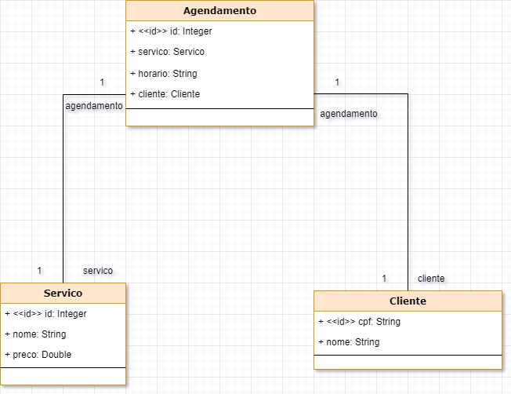

- Repositório com os desafios da Beca de Java

## Plataforma Beauty

Facilitador entre salões de beleza e clientes.
O salão cadastra seus serviços. O cliente acessa esses serviços e faz um agendamento.

### Diagrama Conceitual

#### desafio2
- Criadas as classes controllers (CRUD);
- Implementado o OpenAPI na Spring Rest;
- Implementado ResponseEntity nos retornos das chamadas.